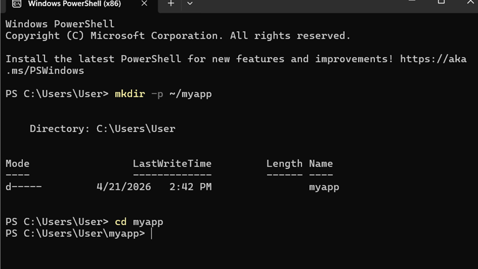

**Title Building Docker image for application**

Aim: To understand building an image for an application using Dockerfile and to implement this task.

Objective:

- To be aware of an Image and container
- To construct a Dockerfile for an application.
- To build Docker image using Docker command.
- To verify and execute the Image.

Theory:

Docker is a platform which we use to develop, Ship, and run applications within containers. An image is an executable package, that bundles up all code, run-time, system tools, system libraries, and settings and the application will run inside it.

The Dockerfile is a text document that contains all the commands that the user could call on the command line in order to assemble an image. Docker reads from the Dockerfile and built an image step by step when the ' docker build ' command is given.

Images are not muttable (cannot be change once built) and containers are run-time instances of images.

Requirements:

Any application(Node.js/ any)

Dockerfile should be created in the project folder.

Docker is installed.

**Procedure**

Step 1: Build the Project Folder

In your terminal or command prompt, create a new folder on the home directory.

$ mkdir -p ~/myapp

mkdir command is used to create the directories, and -p flag create the directories safely if any path component is already present. ~ stands for home directory.

Step 2: Build the Flask Application

In the myapp folder, you can create the python file of the web application as app.py. If your application is not running at the moment, then you need to open the file and modify the port to 5000.

Then run the application through:

$ python app.py

In order to verify whether your application works, you can add any simple question as "What is your name?" and then re-run it.

Step 3: Build the Dockerfile

Open the Notepad, then create a file of name Dockerfile, and paste the below text in the file:

FROM python:3.10-slim

WORKDIR /app

COPY . .

RUN pip install flask

EXPOSE 8080

CMD \["python", "app.py"\]

Make sure the file is saved as Dockerfile and not as Dockerfile.txt

Workflow of creating an Image.

Create -> Write Dockerfile -> Build image-> Run Container.

Step 4: Rename the file if applicable

If your file has been saved as Dockerfile.txt then save the name of the file using the following:

$ ren Dockerfile.txt Dockerfile

And then ensure that your file is saved as port 5000.

(Image of an error when the name was set to Dockerfile.txt and the port was not set to 5000)

Step 5: Build the Docker Image

After building the Dockerfile, build the Docker image by using this command:

$ docker build -t flaskapp

Step 6: Run the Docker Container

The command which is used to run the container is:

$ docker run -p 5000:5000 flaskapp

Step 7: test the Application

Open the browser to check whether your web application is running on or not. You can test by providing the answer to a question to know that your Flask application is working perfectly.

**Conclusion**

Through this experiment, I gained some of the essential information on how to develop and run web applications with Flask and Docker. I was able to understand the overall procedures to development the application file, write the Docker file and build image, then run a container.

Through this experiment, I am clearer on what is containerization, how it can make the deployments of applications to be simpler and more reliable, and also the actual experience using the docker commands and package the application in a portable environment.