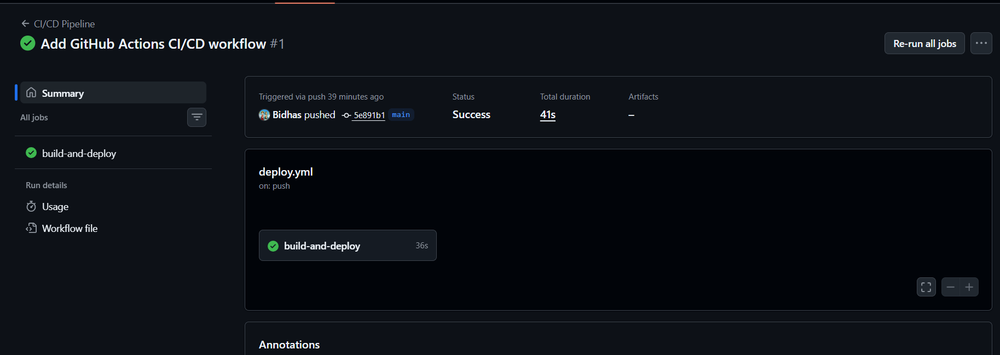
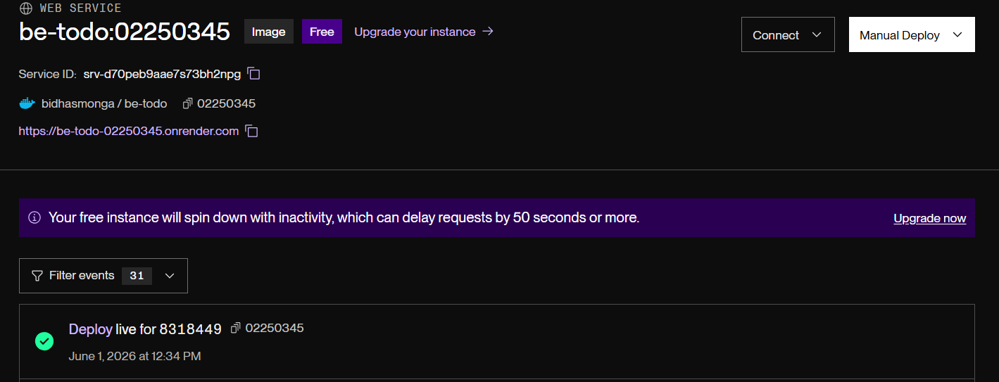

# Assignment 3 - CI/CD with GitHub Actions
**DSO101 | Bidhas Mongar | 02250345**

## Overview
Configured a GitHub Actions workflow to automatically build a Docker image, push it to DockerHub, and deploy it on Render.com on every push to main branch.

## Tools Used
- GitHub Actions (CI/CD automation)
- Docker & DockerHub (containerization & registry)
- Render.com (cloud deployment)

## Steps Taken
1. Created `.github/workflows/deploy.yml` with 4 stages: checkout, DockerHub login, build & push image, trigger Render deployment
2. Added 3 GitHub Secrets: `DOCKERHUB_USERNAME`, `DOCKERHUB_TOKEN`, `RENDER_DEPLOY_HOOK`
3. Pushed code to main branch to trigger the pipeline

## Challenges Faced
- Understanding how Render does not auto-redeploy on new DockerHub image pushes — solved using Render's deploy webhook

## Learning Outcomes
- How to automate full CI/CD pipelines using GitHub Actions
- How to securely store credentials using GitHub Secrets
- How to trigger external deployments via webhooks

## Screenshots
- GitHub Actions: Successful workflow run

- DockerHub: Image pushed (bidhasmonga/todo-app)

- Render.com: Live deployment triggered

## Live Deployment
https://your-render-url.onrender.com